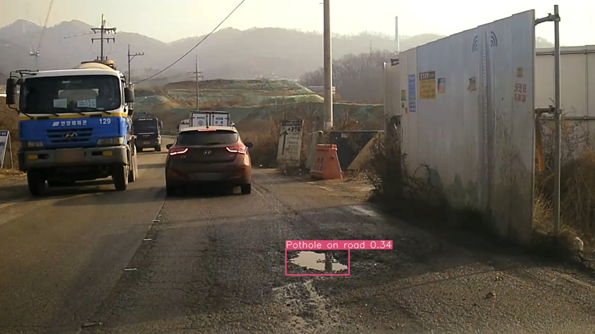
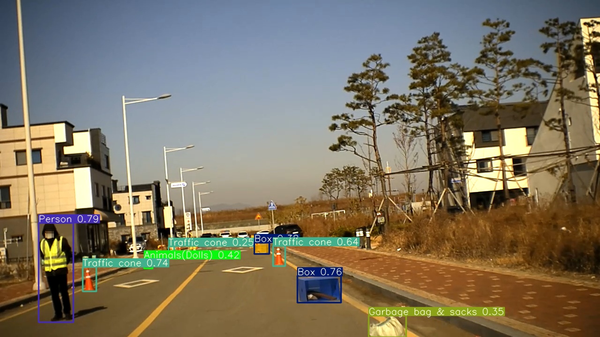
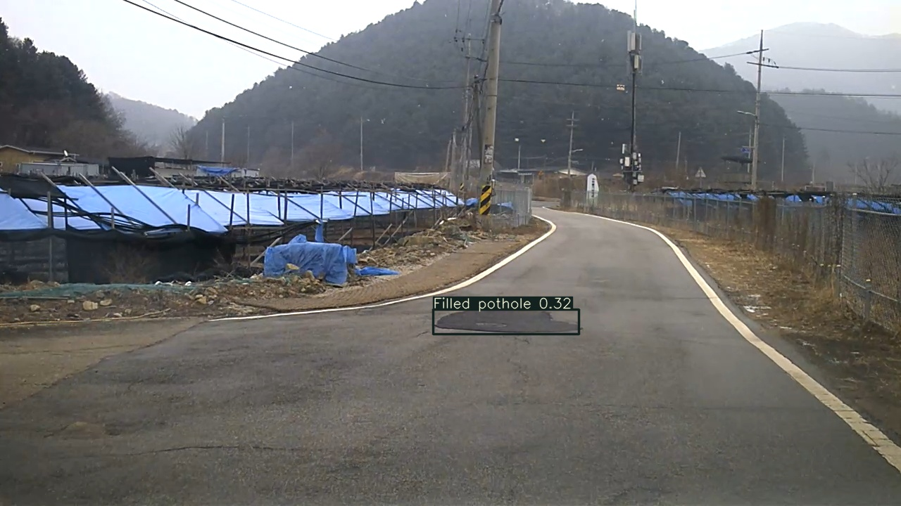
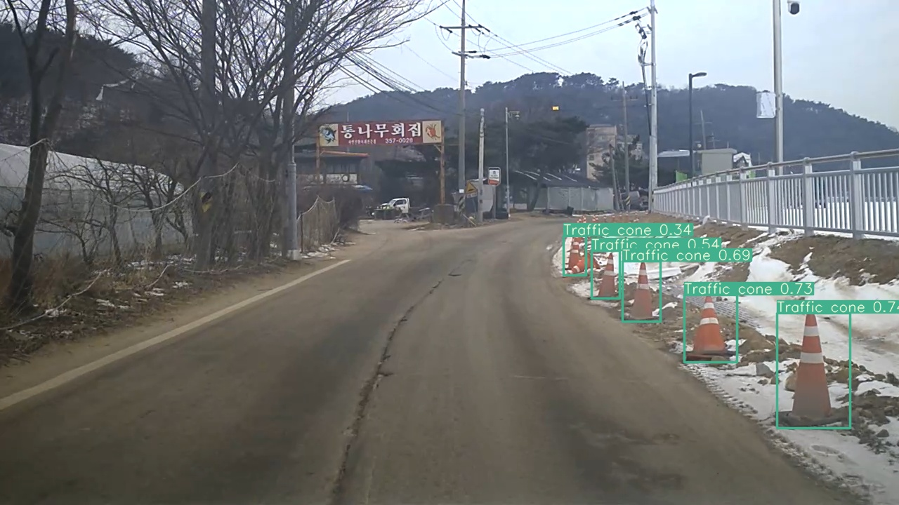
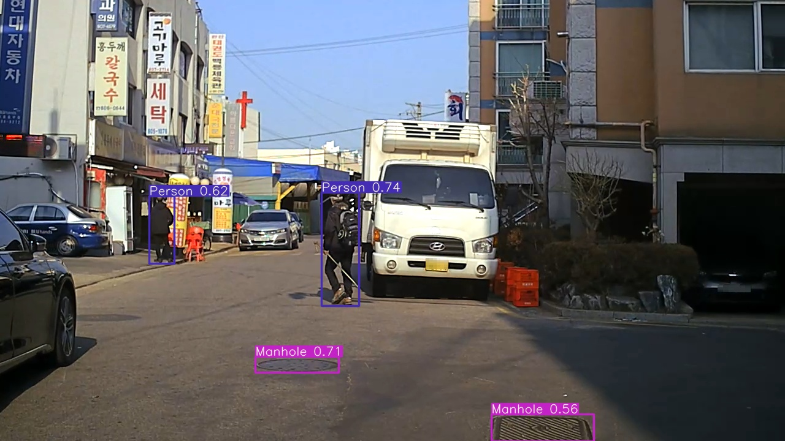

# Detection for Road Damage Dataset

도로 상의 장애물 및 이상 상태 검출을 위한 네트워크: YOLO v5

## Environment
- Cython
- matplotlib>=3.2.2
- numpy>=1.18.5
- opencv-python>=4.1.2
- Pillow
- PyYAML>=5.3.1
- scipy>=1.4.1
- tensorboard>=2.2
- torch>=1.7.0

```bash
  $ pip install -r requirements.txt
```

## Datasets

1. Download databases. Place them into 'database/images' directory.

   다운로드 링크는 기재 예정입니다.

2. Make 'database' directory. Convert json to txt file and place data as follows.
   
   Train/ Test list 는 업로드 예정입니다.
   

```bash
  python convert_yolo.py --annotation_path [your json file path] --image_path [your image file path] --train_list [your train list path] --test_list [your test list path]
```

```bash
dataset

├── split

	├── train
  
	├── [file_name.jpg]
        ├── [file_name.txt]
        ...
    
	├── valid
  
	├── [file_name.jpg]
        ├── [file_name.txt]
        ...
```
## Train
1. Download COCO pre-trained models.
   
   [[YOLO5s.pt]](https://drive.google.com/file/d/1EEHqpblsEVD9JaTYeaj4YW1hqjDCCmRn/view?usp=sharing)
   
   [[YOLO5x.pt]](https://drive.google.com/file/d/1LQP-h1VByut_5qzYk-_HJT25x3axse1s/view?usp=sharing)

2. Run train.py

```bash
    python train.py --data total.yaml --cfg yolov5s.yaml --weights ./yolov5s.pt --batch-size 32
```

## Pre-trained Models
   
1. Download our pre-trained models.

   [[best.pt]](https://drive.google.com/file/d/1H-QBmr_0NUQ3FkIDZ87WTZtyZjK1ECIJ/view?usp=sharing)

2. Place pre-trained models in '/runs/train/exp/weight' directory.

## Evaluation

Run Evaluation.py to evaluate the performance of trained models with following commands.


```bash
    python test.py --data total.yaml --weights ./runs/train/exp/weights/best.pt
```

## Results

Run detect.py to save output images of trained models with following commands.

The Logger will be saved in 'Logger' directory with --logger_system command.

```bash
    python detect.py --weights ./runs/train/exp/weights/best.pt --source [image directory] --logger_system
```

<p align="left">
  
  
</p>
<p align="left">
  
  
</p>
<p align="left">
  
  
</p>
