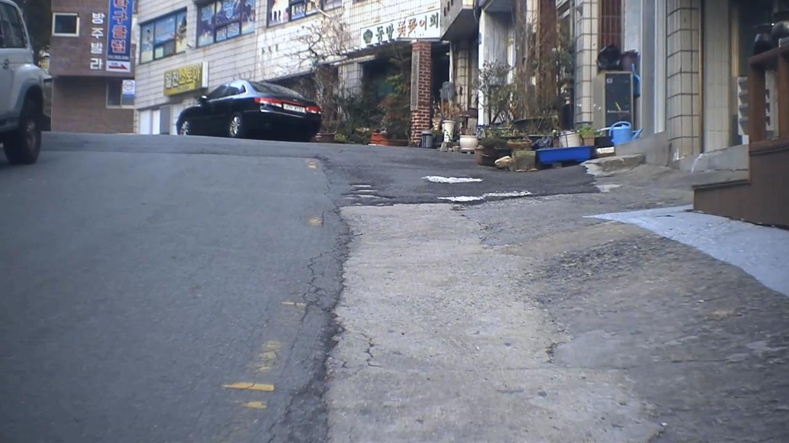

# Segmentation for Road Damage Dataset

도로 상의 크랙 분할화를 위한 backbone 네트워크: PAN (Pyramid Attention Network for Semantic Segmentation)

## Environment
- Cython
- matplotlib>=3.2.2
- numpy>=1.18.5
- opencv-python>=4.1.2
- Pillow
- PyYAML>=5.3.1
- scipy>=1.4.1
- tensorboard>=2.2
- torch>=1.7.0
- Segmentation-models-pytorch==0.1.3

```bash
  $ pip install -r requirements.txt
```

## Datasets

1. Download databases.

   다운로드 링크는 기재 예정입니다.
   
2. Convert polyline to binary image.

```
    python preprocess.py 
```
   
## Train (validation included)
1. Run train.py

```
    python train.py 
```

## Pre-trained Models

1. Download our pre-trained models.
[[pre-trained model]](https://drive.google.com/file/d/1i9BT-iJZeHgU5l0IArqG6Jn3zYsiFp-Q/view?usp=sharing)
   
2. Place pretrained models in './trained_model' directory.

## Evaluation

Run test.py to evaluate the performance and save output images of trained models with following commands.

```
    python test.py 
```

## Results

<p align="left">
  
  
  
</p>
<p align="left">
  
  
  
</p>
<p align="left">
  
  
  
</p>


